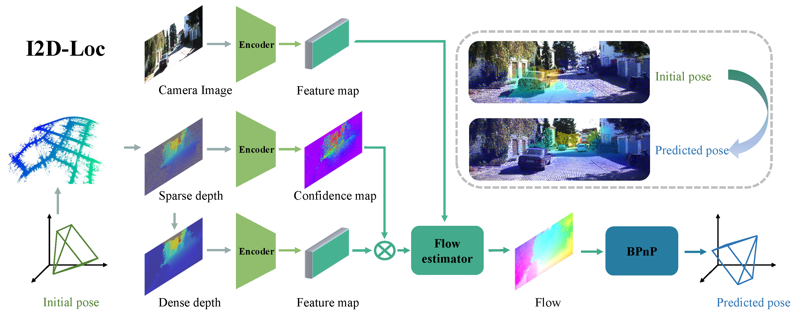

# I2D-Loc
This repository contains the source code for our paper:

[I2D-Loc: Camera localization via depth to image flow](https://levenberg.github.io/I2D-Loc/)<br/>
ISPRS 2022 <br/>
Kuangyi Chen and Huai Yu<br/>



## Requirements
The code has been tested with PyTorch 1.12 and Cuda 11.6.
```Shell
conda create -n i2d python=3.7 -y
conda activate i2d
pip install -r requirements.txt
pip install torch==1.12.0+cu116 torchvision==0.13.0+cu116 torchaudio==0.12.0 --extra-index-url https://download.pytorch.org/whl/cu116
cd core/correlation_package
python setup.py install
cd ..
cd visibility_package
python setup.py install
cd ../..
```

## Demos
Pretrained models can be downloaded from [google drive](https://drive.google.com/drive/folders/19VWNCPR1me7SnON1NYJRFrdgd1sKj052?usp=sharing)

You can demo a trained model on a sequence of frames
```Shell
python demo.py --load_checkpoints checkpoints/2_10/checkpoints.pth --render
```

## Required Data
To evaluate/train I2D-Loc, you will need to download the required datasets.
* [KITTI](https://www.cvlibs.net/datasets/kitti/eval_odometry.php)

We trained and tested I2D-Loc on the KITTI odometry sequences 00, 03, 05, 07, 08, and 09.
To obtain the whole LiDAR maps, we aggregate all scans at their ground truth positions. 
Then, we down-sample the LiDAR maps at a resolution of 0.1m. The downsampled point clouds are saved as h5 files.

Use the script preprocess/kitti_maps.py with the ground truth files in data/ to generate the h5 files.

```Shell
python preprocess/kitti_maps.py --sequence 00 --kitti_folder ./KITTI_ODOMETRY/
python preprocess/kitti_maps.py --sequence 03 --kitti_folder ./KITTI_ODOMETRY/
python preprocess/kitti_maps.py --sequence 05 --kitti_folder ./KITTI_ODOMETRY/
python preprocess/kitti_maps.py --sequence 06 --kitti_folder ./KITTI_ODOMETRY/
python preprocess/kitti_maps.py --sequence 07 --kitti_folder ./KITTI_ODOMETRY/
python preprocess/kitti_maps.py --sequence 08 --kitti_folder ./KITTI_ODOMETRY/ --end 3000
python preprocess/kitti_maps.py --sequence 08 --kitti_folder ./KITTI_ODOMETRY/ --start 3000
python preprocess/kitti_maps.py --sequence 09 --kitti_folder ./KITTI_ODOMETRY/
```

The final directory structure should looks like:

```Shell
├── datasets
    ├── KITTI
        ├── sequences
            ├── 00
                ├── image_2
                    ├── *.png
                ├── local_maps_0.1
                    ├── *.h5
                ├── calib.txt
                ├── map-00_0.1_0-4541.pcd
                ├── poses.csv
            ├── 03
            ├── 05
            ├── 06
            ├── 07
            ├── 08
            ├── 09
```

## Evaluation
You can evaluate a trained model using `main.py`
```Shell
python main.py --data_path /data/KITTI/sequences --load_checkpoints checkpoints/2_10/checkpoints.pth -e
```


## Training
You can train a model using `main.py`. Training logs will be written to the `runs` which can be visualized using tensorboard.
```Shell
python main.py --data_path /data/KITTI/sequences --test_sequence 00 --epochs 100 --batch_size 2 --lr 4e-5 --gpus 0 --max_r 10. --max_t 2. --evaluate_interval 1
```
If you want to train a model using BPnP as back-end, you can use `main_bpnp.py`.
```Shell
python main_bpnp.py --data_path /data/KITTI/sequences --test_sequence 00 --epochs 100 --batch_size 2 --lr 4e-5 --gpus 0 --max_r 10. --max_t 2. --evaluate_interval 1
```